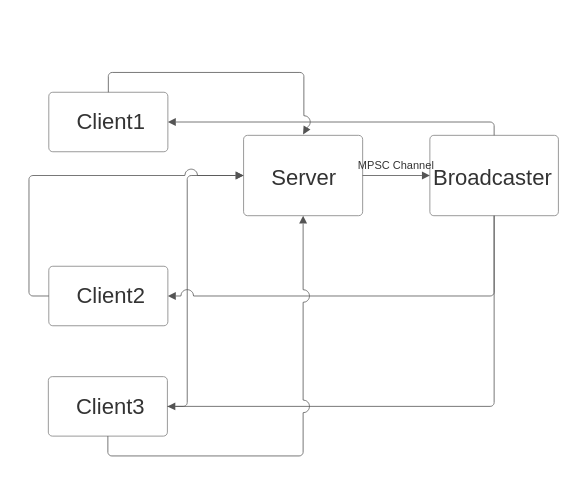

# Event driven, multi-threaded, asynchronous, multiclient single server broadcasting command line chat application.

This is a simple client server chat application.

Each client connects to the server via a TCP connection. The client program first asks the user what their name is. And then prepands their name to every single outgoing message. Like so: `[Name]: Message`

The server when it receives a new connection request, splits the stream into two parts. A read stream and a write stream.  It spawns a Tokio task for listening to the client and reading their messages. The write stream is transferred to the broadcaster via a MPSC channel. The broadcaster as soon as it receives the message, adds the socket to it's internal list of active sockets.

When a new message arrives from the client, that also gets sent to the broadcaster via the MPSC channel which then broadcasts it to all the clients including the client who just sent the message.